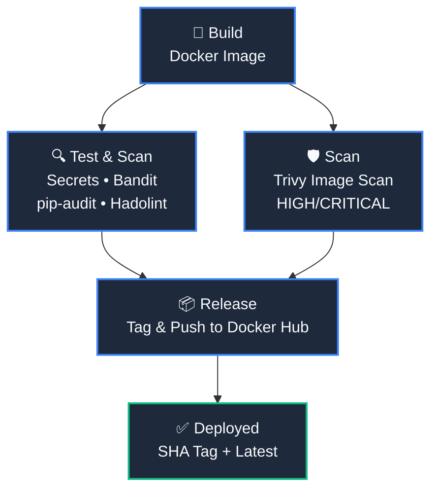

# DevSecOps Pipeline

```mermaid
graph TD
    A["🔨 Build<br/>Docker Image"] --> B["🔍 Test & Scan<br/>Secrets • Bandit<br/>pip-audit • Hadolint"]
    A --> C["🛡️ Scan<br/>Trivy Image Scan<br/>HIGH/CRITICAL"]
    B --> D["📦 Release<br/>Tag & Push to Docker Hub"]
    C --> D
    
    D --> E["✅ Deployed<br/>SHA Tag + Latest"]
    
    style A fill:#1e293b,stroke:#3b82f6,stroke-width:2px,color:#f8fafc
    style B fill:#1e293b,stroke:#3b82f6,stroke-width:2px,color:#f8fafc
    style C fill:#1e293b,stroke:#3b82f6,stroke-width:2px,color:#f8fafc
    style D fill:#1e293b,stroke:#3b82f6,stroke-width:2px,color:#f8fafc
    style E fill:#1e293b,stroke:#10b981,stroke-width:2px,color:#f8fafc
```
