# DevSecOps Pipeline

```mermaid
graph TD
    A["🔨 Build<br/>Docker Image"] --> B["🔍 Test & Scan<br/>Secrets • Bandit<br/>pip-audit • Hadolint"]
    A --> C["🛡️ Scan<br/>Trivy Image Scan<br/>HIGH/CRITICAL"]
    B --> D["📦 Release<br/>Tag & Push to Docker Hub"]
    C --> D
    
    D --> E["✅ Deployed<br/>SHA Tag + Latest"]
    
    style A fill:#1e293b,stroke:#3b82f6,stroke-width:2px,color:#f8fafc
    style B fill:#1e293b,stroke:#3b82f6,stroke-width:2px,color:#f8fafc
    style C fill:#1e293b,stroke:#3b82f6,stroke-width:2px,color:#f8fafc
    style D fill:#1e293b,stroke:#3b82f6,stroke-width:2px,color:#f8fafc
    style E fill:#1e293b,stroke:#10b981,stroke-width:2px,color:#f8fafc
```



# Overview
This project shows a simple DevSecOps pipeline built with GitHub Actions.
The goal is to build a Docker image and check for security issues early and automatically whenever code is pushed to the main branch.
It focuses on catching problems before they reach production.

# What This Pipeline Does
When you push code to ```main```, the pipeline runs and does the following:

1. **Gets the code**
   It checks out the latest version of the repository.
2. **Scans for secrets**
   It looks for exposed secrets like API keys or passwords.
3. **Sets up Python**
   Python is installed so security tools can run.
4. **Checks Python code security**
   The pipeline scans the code for serious security issues.
   If lower-risk issues are found, the pipeline continues.
5. **Checks Python dependencies**
   It looks for known vulnerabilities in installed packages.
6. **Checks the Dockerfile**
   The Dockerfile is reviewed to catch bad practices early.
7. **Builds the Docker image**
   A Docker image is created using the current commit.
8. **Scans the Docker image**
   The image is scanned for high and critical vulnerabilities.
   If serious issues are found, the pipeline fails.
9. **Tags the image**
    The image is tagged with:
    - the commit ID
    - latest
10. **Pushes the image to Docker Hub**
    The final image is uploaded so it can be reused or deployed

# Why This Project Matters
- Security checks happen automatically
- Problems are caught early
- Builds are consistent and repeatable
- No manual steps needed after pushing code
  
This is a practical example of shifting security left in a CI/CD pipeline.

# Tools Used
- GitHub Actions
- Gitleaks
- Bandit
- pip-audit
- Hadolint
- Trivy
- Docker & Docker Hub

# Notes
Some security checks are set to **warn instead of fail**.
This makes the pipeline beginner-friendly while still showing potential risks.
